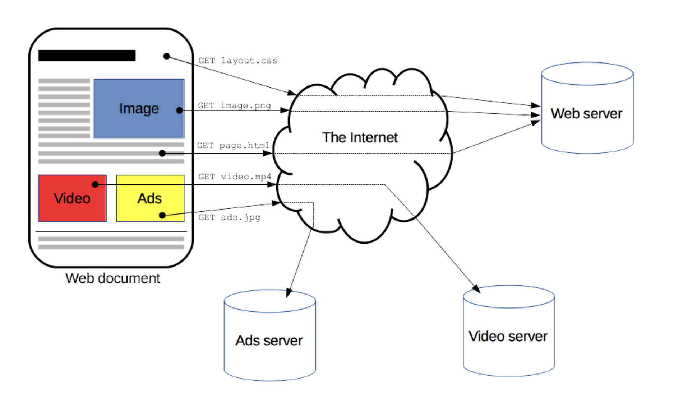
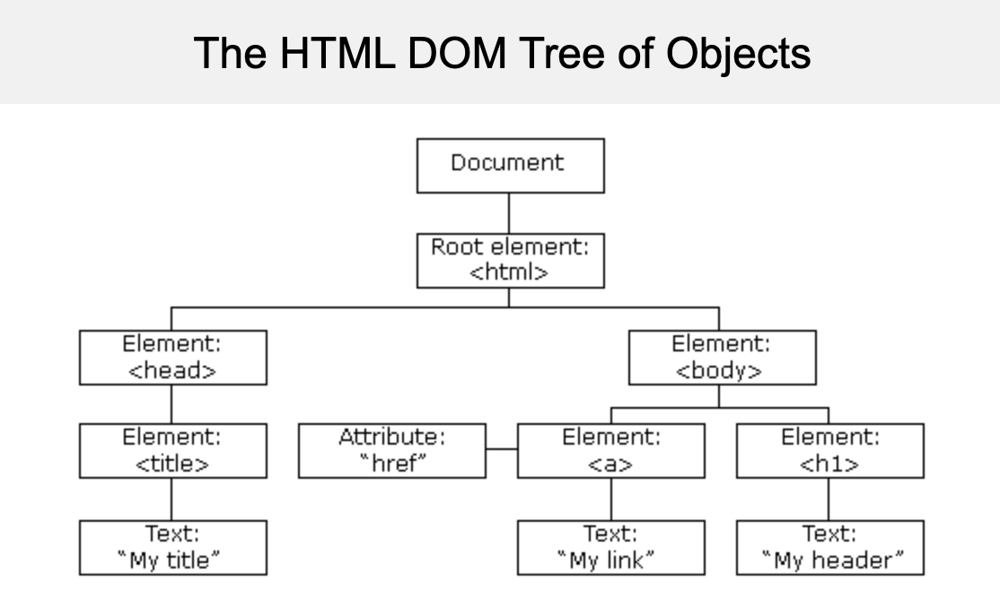
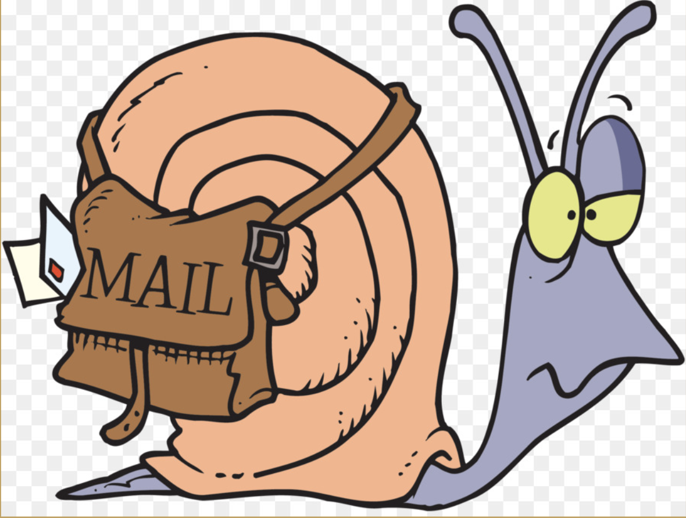
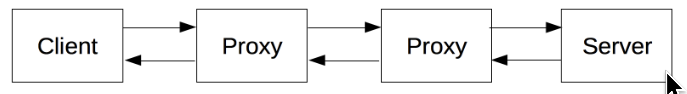
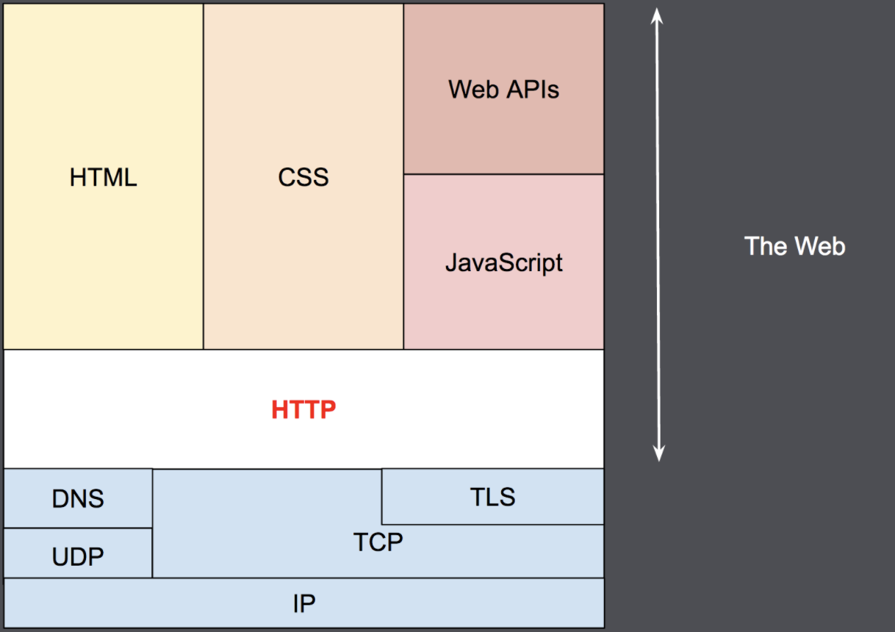

# Networks

## GitHub Branches

- Git manages version control for you.
- GitHub Desktop is an application that manages Git and syncs it between your local server (the harddrive of your computer) and your remote server (GitHub.com's cloud).
- So far, you've only used Git to version control independent projects.
- Now we're going to use a GitHub feature called **branches** to push changes you make to others and pull changes from others so that you can work collaboratively.
- [Anatomy of a Branch](https://guides.github.com/introduction/flow/)
- The central branch is called **main** (this is where your commits will go if no other branch is specified - but we don't want to edit the main branch if we're working collaboratively [used to be called "master"]).
- Branches exist as separate until a `merge` is executed.
- To make a branch in the Github Desktop app, click on "Current Branch" in the top bar and then click "new branch".
- To checkout a branch in the Github Desktop app, click "Current Branch" and then click on the branch you'd like to checkout.
- To merge a branch on GitHub Desktop, click "Current Branch" and then "Choose a branch to merge into...".

## Rachel makes a branch of the class repository

## Everyone makes a branch of the class repository
- Before *anything* make sure you have pulled my most up-to-date main branch!
- Create your own branch of the class repository
- Edit under your family name in branchesdemo.md in this folder
- Merge your changes to the main branch!

## Anatomy of a Website

## Document Object Model
- W3C World Wide Web standard
- "Platform and language-neutral interface that allows programs and scripts to access and update the contetn, structure, and style of a document"
- Core DOM is standard model for all documents, HTML DOM is for HTML documents

## HTML
- HyperText Markup Language
- References something else that can be immediately accessed
- MarkDown is HTML-lite: a text-editor to HTML quick converter.
- HTML: more tags, more structure, more reference options than MarkDown

## Servers and Ports
- HTML documents and other assets have to be hosted on servers
- Server: computer (can be virtual!) connected to the internet that can respond to messages for services.
- Port: specifies what kind of service the message is for.
- How do these computers communicate with each other?

## Protocols
- What protocols do you know and love?
  - MIDI?
### Transmission Control Protocol/ Internet Protocol
  - Rules that specify how computers can communicate with each other
  - Internet relies on these protocols to work
  - Early Internet
    - DoD
    - Everything mediated through a mainframe
  - TCP/IP Bundled with Unix in early 70s research computers
    - host-to-host
  - IP addresses mark uniquely identifiable servers
  
  - VPN, anyone?
  - **IPv4 v IPv6**, an interlude:
    - IPv4 could only represent about 4 billion values
    - IPv5 was being designed to be dedicated for streaming
    - IPv6 can represent 2^128 values, beat IPv5 out

### Uniform Resource Locator and Domain Name Search
  - If you type a URL into a browser, the browser uses the DNS to loopk up the IP, then sends a request to the IP for access to the assets on the server.
  - The server doesn't automatically trust the browser (or vice-versa!)

### HyperText Transfer Protocol

  - a client-server protocol
  - browser (client/recipient) requests FETCHING of assets. (Where have we heard that before?)
  - Complete browser page is constructed from different fetched sub-documents (see Anatomy of a Website again.)
  - This is the foundation of information exchange on the internet.
  - Cache (good for you) & Cookies (good for digital capitalism): stored on client side

### All together now:

  - Cascading Style Sheets make sites pretty
    - Inline vs External
  - JavaScript makes sites more interactive, dynamic
  - TLS is for encryption
  - UDP is for ultra-low latency

## Take a look at how it all comes together on your favorite site!
- Open up favorite site in Chrome
- "View">"Developer">"ViewSource"
- Now go through all developer tools

## HTML5 BASICS with [rdwrome.github.io](https://rdwrome.github.io/)
  - Declare HTML5
  - headers
  - paragraphs
  - horizontal rulers
  - blockquotes
  - bold
  - italics
  - breaks
  - anchors
  - images/gifs
  - lists
  - audio
  - divisions
  - css!

- **HTML+CSS Resources**
	- [HTML4 vs. HTML5 and browser info](https://www.wpkube.com/html5-cheat-sheet/)
	- [Declaring HTML5](https://developer.mozilla.org/en-US/docs/Web/Guide/HTML/HTML5/Introduction_to_HTML5)
	- [Complete HTML5 Cheat Sheet](https://websitesetup.org/wp-content/uploads/2019/08/HTML-CHEAT-SHEET.png)
	- [HTML5+CSS3 Demo Websites](https://html5up.net/)
	- [CSS Templates](https://www.w3schools.com/css/)
	- [bootstrap](https://getbootstrap.com/docs/4.3/getting-started/contents/#css-files)

- **[Building a Website with pages.github.com](https://pages.github.com/)**
	- User site
	- GitHub Desktop!

- [Sample Website](https://kariestes.github.io/)

### Groups
TODO
 
TODO
 
TODO
 
TODO

## FINAL PROJECT PROPOSAL
