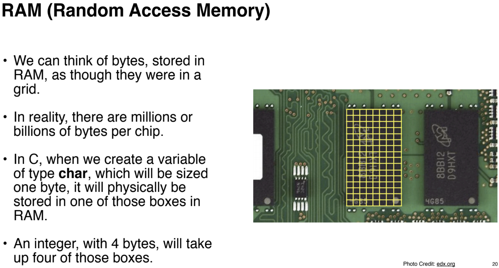
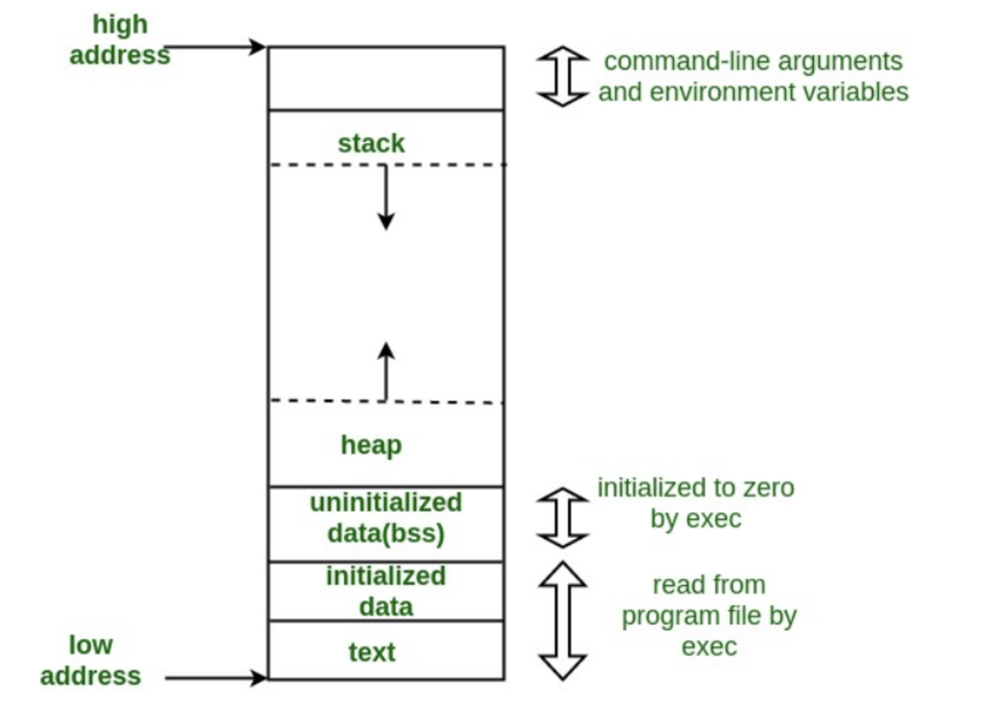
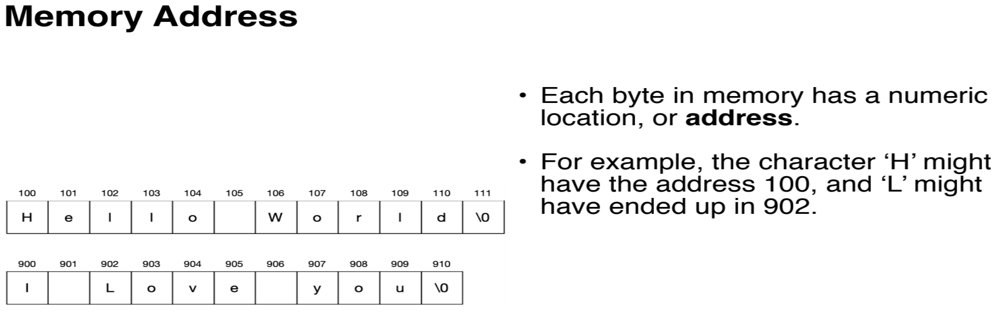
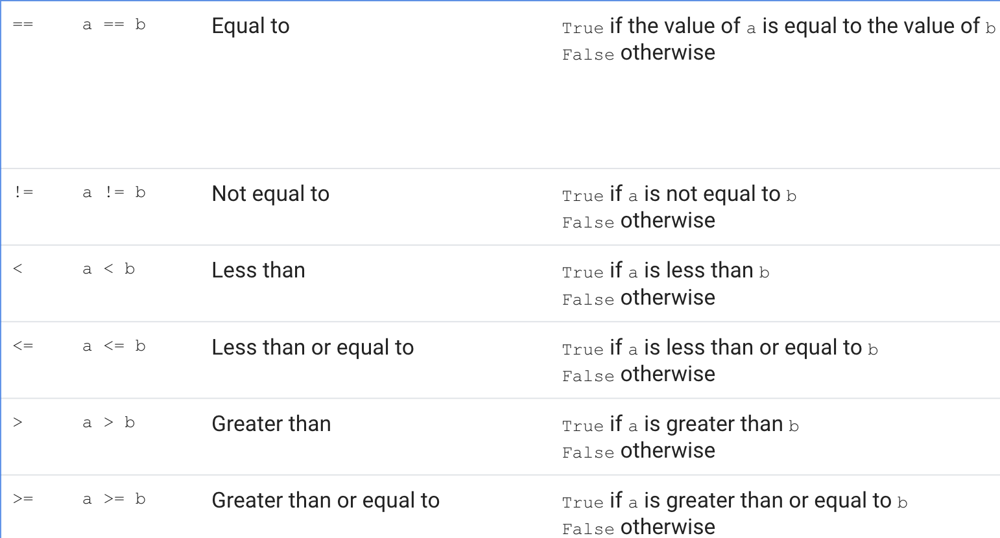

## Memory

**[How Computer Memory Works Ted-Ed by Kanawat Senanan](https://www.youtube.com/watch?v=p3q5zWCw8J4)**

**RAM**

	- Structure
		- Address Line: where data moves in 1 bit pulses of electricity
		- Data Line: where data is is stored (8 bits in every Byte)
		- Transistor (type of semi-conductor): switches signals
		- Capacitor: stores electricity

**Data Types**

	- certain kinds of data take up certain amounts of memory
	- integer is also 4 bytes or 32 bits in Python, float is 8 bytes or 64 bits

**Memory Layout**

	- Stack
		- Where variables and functions hang out waiting to be used (environment)
	- Heap
		- Where to find free memory for environment
	- Low address
	- High address

**Memory Address**

	- With characters/strings

## Previously on LMSC-261
**Python**
- High-level
- General but!
	- [Modules and libraries can make it more specific](https://wiki.python.org/moin/UsefulModules)
		- Modules: simple .py file that abstracts out specific information (functions, variables, other things)
		- libraries (or packages) are a collection of modules
- Interpreted
  - Easier to debug
  - Runs a little slower
- Object-oriented
- Scripts are a sequence of definitions and commands executed in the shell
<pre> >>> </pre>
- #nocommentcomment

**Objects**
- Made up up values (result of calculation) and variables
- What Python manipulates

**Variables**
- Binds names to objects
- Variables are really easy to assign and reassign
- We can parameter pass
- CODE ALONG
	<pre>
	one = 1
	two = 2
	three = one + two
	print(three)
	</pre>

**Operators**
- Simple
<pre>
+
-
*
/
%
// - floor division (ignores the remainder) i.e 6//4 is 1 because 4 only goes into 6 once.
** - raised to the power of</pre>
- PEMDAS (parentheses, exponents, multiplication, division, addition, subtraction) applies!

- Boolean/Comparison
	- Checks for truth!

**Expressions**
- Made up of objects+operators

**Keywords**
- Only variable naming rules
<pre>
False      class      finally    is         return
None       continue   for        lambda     try
True       def        from       nonlocal   while
and        del        global     not        with
as         elif       if         or         yield
assert     else       import     pass
break      except     in         raise
</pre>

## Python + Memory Address

**Strings**
	<pre>
	#len function
	len('rachel devorah wood rome')
	///
	#indexing
	myName = 'rachel'
	///
	myName[3]
	///
	#slicing
	myName[0:3]
	///
	myName[2:4]
	///
	myName[0:]
	#concatenation
	'yum'+'my'
	'yum' * 3
	</pre>

## Input and Output
- type
<pre>
type(10)
type(10.5)
type("Hello, World!")
type(True)
</pre>
- Get String
<pre>
str = input("Name: ")
print("Hello,", str)
</pre>
- Printing paramenters and f-String
<pre>
#str = input("Name: ")
print("Hello,", str, sep='')
///
#str = input("Name: ")
print(f"Hello, {str}")
</pre>
- Printing floating points
	- what is π?
<pre>
z = 3.14159265358979323846264338327950288419716939937510
///
print(f"{z}")
print(f"{z:.50f}")
</pre>
- f-String math
	- int
<pre>
bags = 3
bananas = 12
print(f"{bananas} bananas were split into {int(bananas / bags)}groups to fit into {bags} bags.")
</pre>
	- float (with parameter passing)
<pre>
f = 99
c = (f - 32) * 5 / 9
print(f, f"Fahrenheit is: {c:.2f} Celsius")
</pre>
- Special characters
- tab and new line
<pre>
print("col1\tcol2\tcol3\ncol1\tcol2\tcol3\ncol1\tcol2\tcol3")
</pre>

## Bugs in the Wild

**Syntax**

- Your code broke a structure/expectation rule

**Runtime**

- Something broke while it was running

**Semantic**

- Something is not right and your computer doesn't know it but you do

## Control Flow preview

**Loops**
<pre>
count = 0
while (count < 12):
    count = count + 1
    print("Happy Valentine's Day @}-,--")
</pre>

**IF/ELSE**
<pre>
# answer yes or no
c = input("Answer: ")
if c == "Yes" or c == "yes":
	print("yes")
elif c == "No" or c == "no":
	print("no")
</pre>

**Conditions**
<pre>
# compare x and y
x = input("integer, please, we'll call x: ")
y = input("(another)integer, please, we'll call y: ")
if x < y:
  print("x is less than y")
elif x > y:
  print("x is greater than y")
else:
  print("x is equal to y")
</pre>
