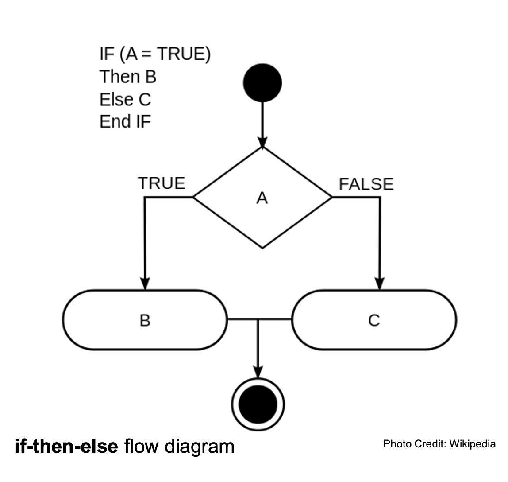

# Scratch

## Reading Group Reports

## Sequential Execution
- Your instructions are executed in the same order they appear in your program (usually top to bottom)

## Conditions
- Something that must be true for something to happen
- "Boolean logic" - the language of computers (0s and 1s)
- "Evaluate to True" or "Evaluate to False"
- Checks truth statement/checks for "truthiness"

## Other Basic Principles
- Functions: actions/verbs (little mini-programs that are "encapsulated")
- Variables: grasp and store values
- Loops: cycles/reiterations of execution
- Syntax: expectations information organization
- Threads: multi-tasking

## Pseudocode
- Break down the way to solve to problem into the smallest tasks possible, but in the language you speak to yourself
- Think like a computer, be literal! Algorithmic thinking!

## Simon Says Pseudocode
 Imagine we are each a machine. Give us precise instructions for a simple dance using one function, one condition, and one loop. 

## Code Reuse
- Stand on the shoulders of giants
- Be a good collaborator

## Compiled vs Interpreted Computer Languages
- Compiled: human readable > machine readable
- Interpreted: human readable > interpreter > machine readable

## Compiled languages: Source, Object, Compiler, Executable
- Source: what we write (human readable)
- Compiler: translates from source to object
- Object: binary (machine readable) (*you'll need one of these for the homework next week, hint hint*)
- Executable: actually runs program

## Compiled languages
- Fortran
- C

## Interpreted languages
- Python
- JavaScript

## [Scratch](https://scratch.mit.edu/)
- Sprites: characters
- Costume: image of character
- Threads: how to multi-task
- How to save as an .sb3 file
